#   Clone IG Flutter
Cloning IG

##  Tech Stack And Libraries
-   Java Springboot -> Backend
-   MySQL -> Database
-   Flutter -> Mobile Framework
-   Provider -> State Management
-   Dio -> Client Request
-   Photo Manager -> Get User Photo Albums
-   Intl -> Time Management
-   Flutter Toast -> Toast Management
-   Shared Preferences -> Authentication Management
-   Pull To Refresh -> User Home Scrolling Effect
-   Robohash -> to load user avatar

##  How To Run
1. Make sure the back-end already running
2. This project is not using environment (String.fromEnvironment(..)) so you have to change base_url in `lib/core/constant/url.dart`
```
    class ConstantURL {
        static const BASE_URL = "http://10.0.2.2:8080"; // ONLY CHANGE THIS WITH YOUR BACKEND URL
        static const POST_IMAGE_URL = "$BASE_URL/files/post/"; 
        static const USER_IMAGE_URL = "https://robohash.org/";
    }
```
3.  Run Flutter Project with profile mode for better performance
```
flutter run --profile
```
4. Login with this account dummies
```
username: codi.ziemann
password: dummy123
```
5. Explore..

##  Feature
**Authentication**
- Login
- Register

**Home**
-  Show Stories in home (but not clickable) the story data is only dummies.
-  Show Post in home based on user followings.

**Profile**
-  Search Users
-  Open User Profile
-  Follow Users

**Posts**
-  Show Post Item (Author, Picture, Description, Comment & Likes Count) & Expanding Post Description.
-  Like Post..
-  Create Post

**Comments**
-   Show Comments based on Post
-   Add Comments


##  Preview
### **Authentication**
<div>
    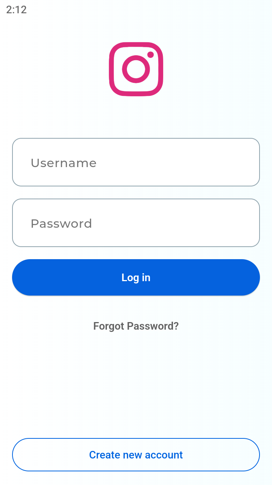
    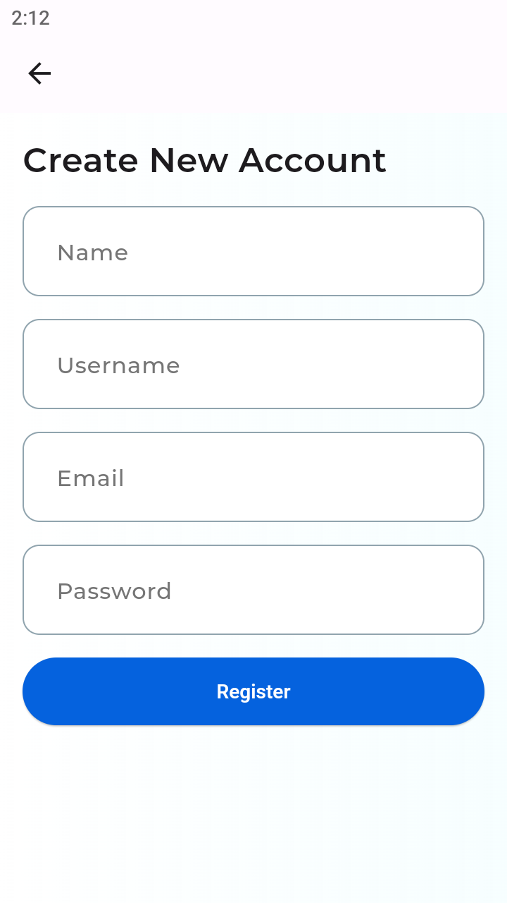
</div>

### **Home**
<div>
    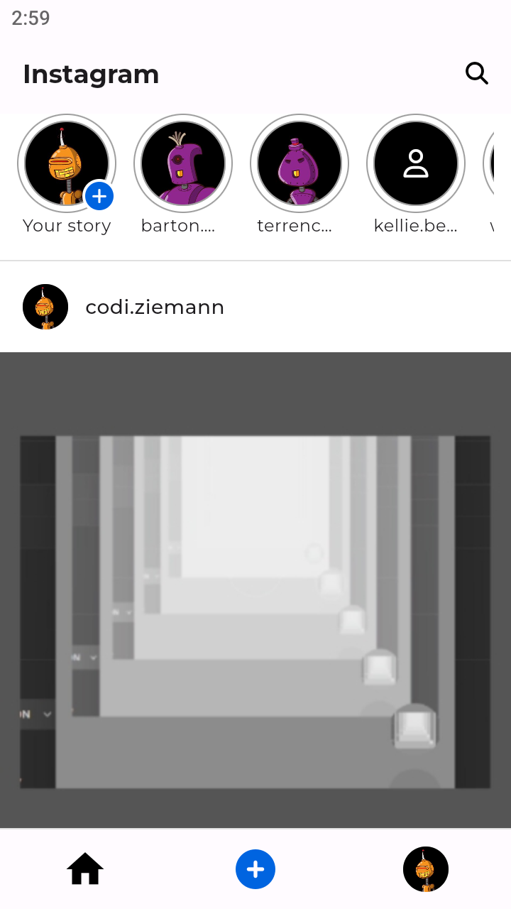
</div>

### Profile
<div>
    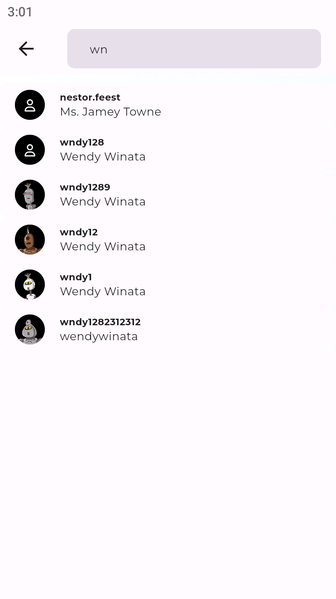
    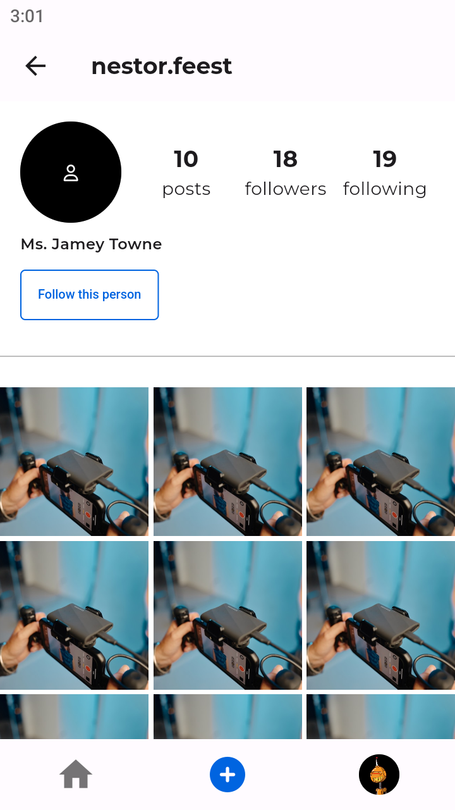
</div>

### Posts
<div>
    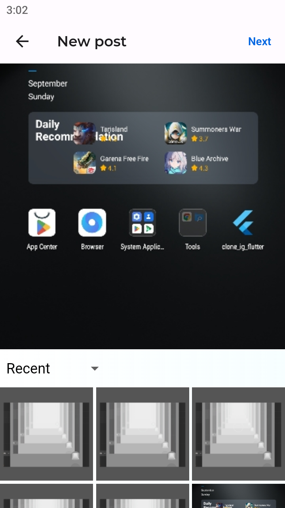
    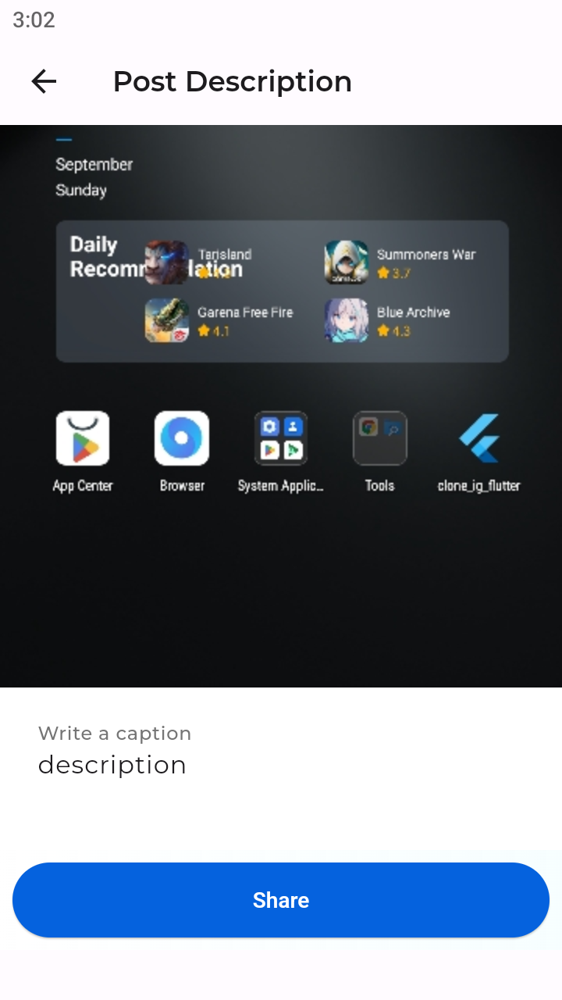
    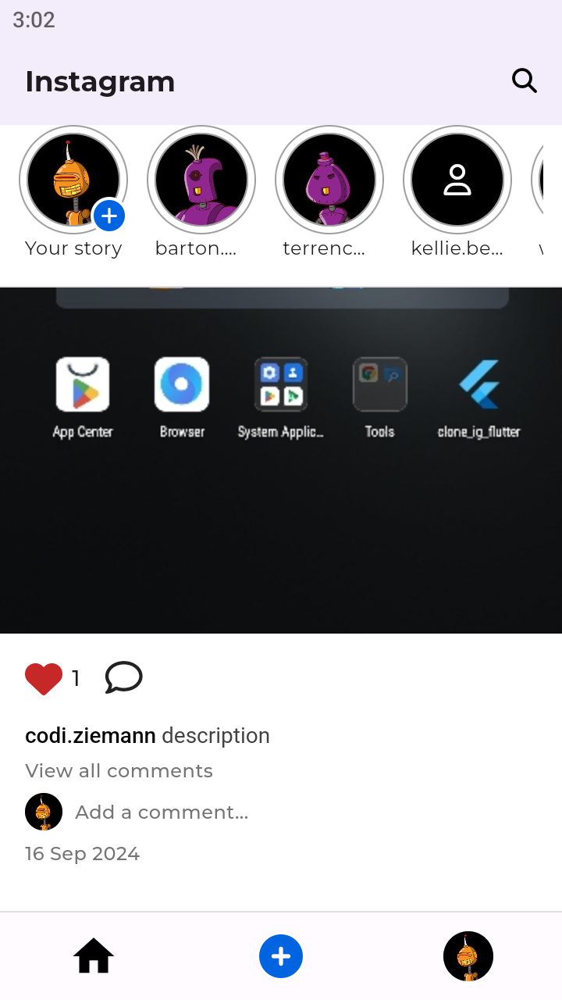
    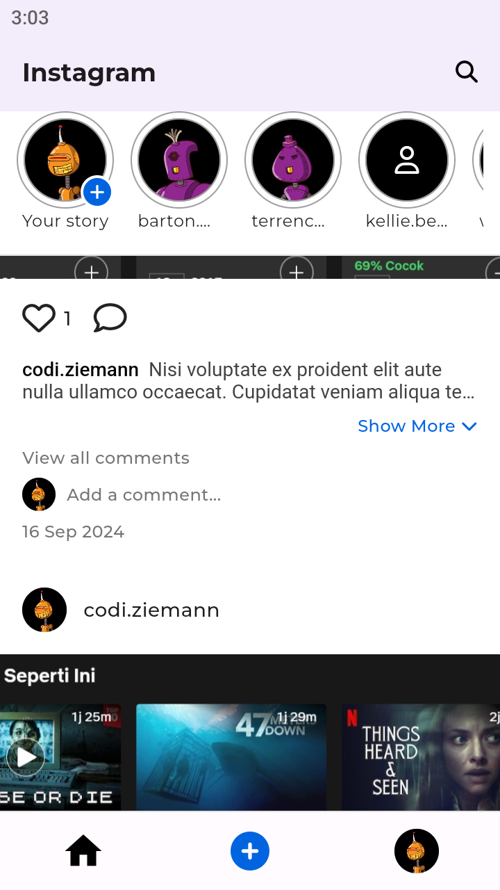
    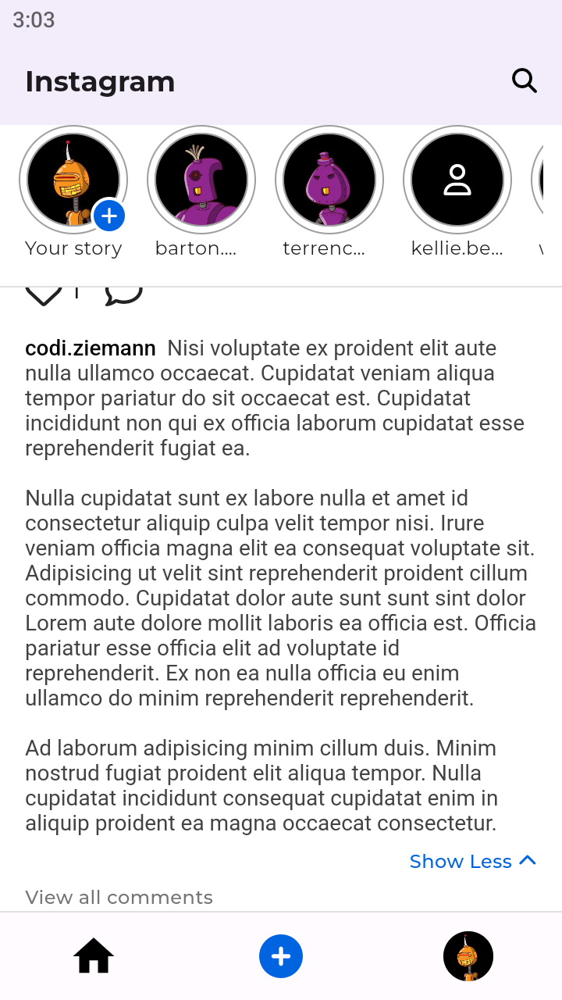

</div>

### Comments
<div>
    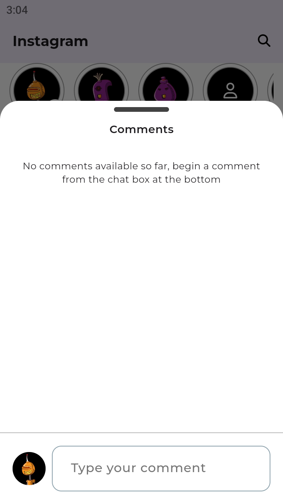
    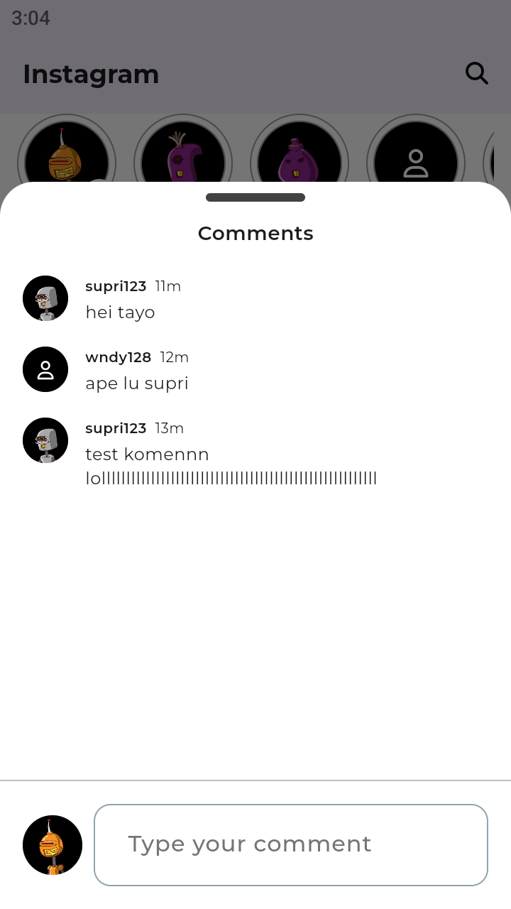
    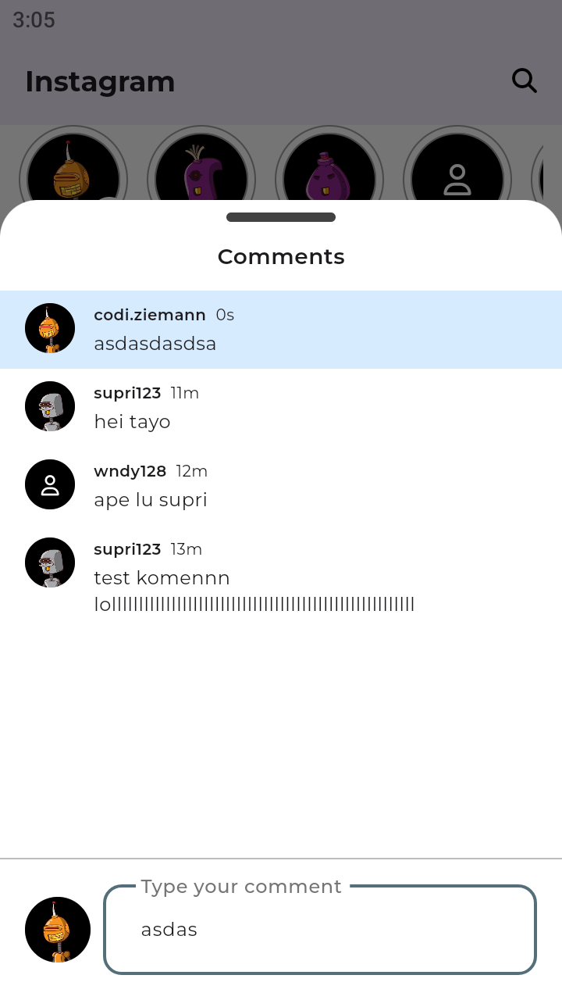
</div>


